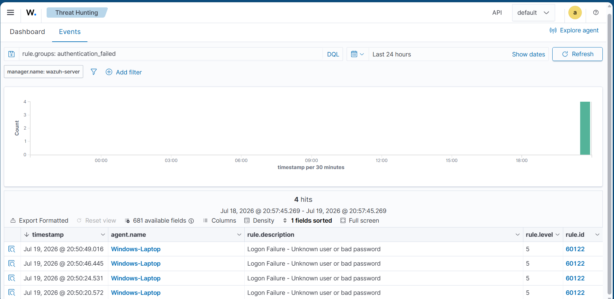
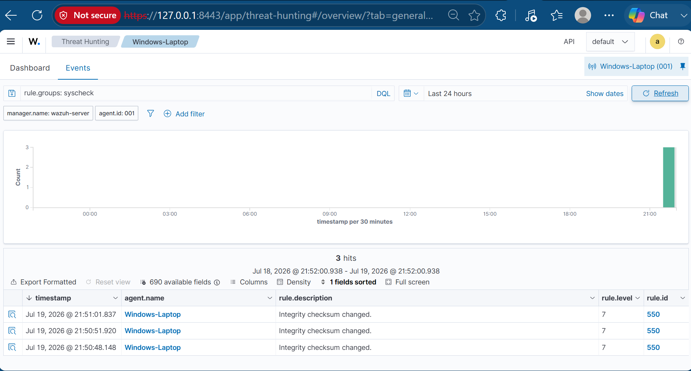
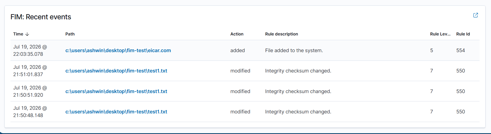
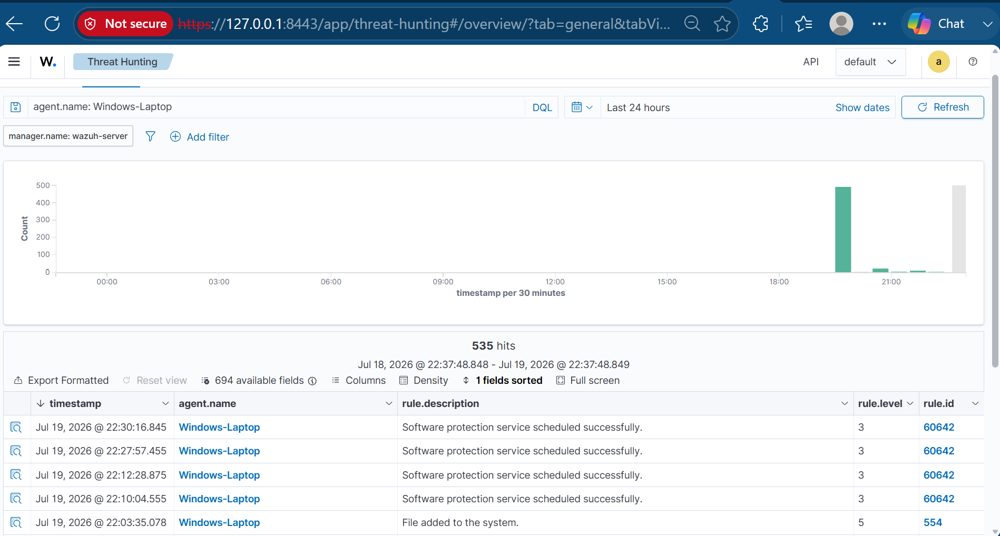
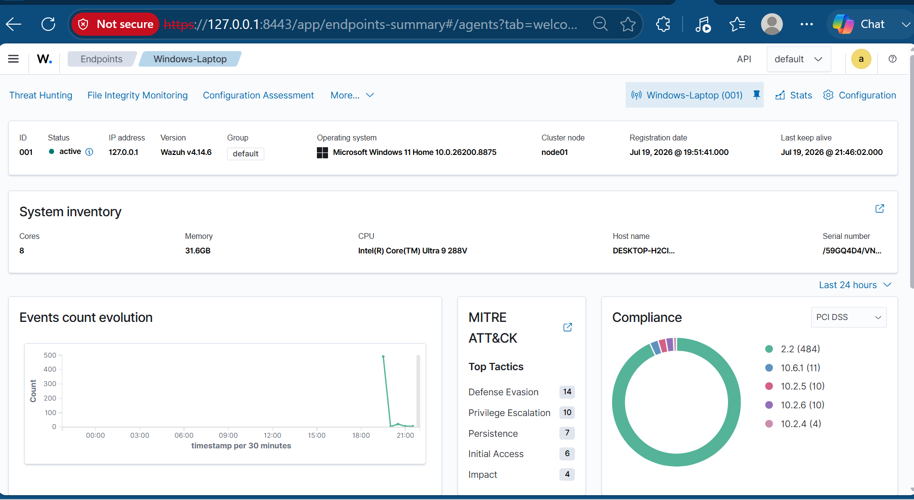

# Cybersecurity Lab — Wazuh SIEM & Endpoint Monitoring

## Project Overview

Deployed and configured a Wazuh security monitoring lab using the official Wazuh OVA in Oracle VirtualBox. The lab focused on setting up a working SIEM environment, connecting a Windows endpoint as an agent, validating agent communication, and confirming that Wazuh was collecting security events from the monitored system.

This project helped demonstrate endpoint visibility, centralized security monitoring, agent deployment, service validation, and troubleshooting of network connectivity between a Windows host and a Wazuh server.

> This lab was completed in a controlled educational environment. No real organizational systems, unauthorized devices, or production networks were monitored.

---

## Lab Environment

| Component | Details |
|---|---|
| SIEM Platform | Wazuh v4.14.6 OVA |
| Virtualization | Oracle VirtualBox |
| Wazuh Server | Wazuh Manager, Indexer, and Dashboard |
| Monitored Endpoint | Windows 11 Home |
| Agent Name | Windows-Laptop |
| Connection Method | VirtualBox NAT with Port Forwarding |
| Dashboard URL | `https://127.0.0.1:8443` |

---

## Tools and Technologies Used

- Wazuh SIEM
- Wazuh Agent
- Wazuh Dashboard
- Oracle VirtualBox
- Windows PowerShell
- Windows Services
- NAT Port Forwarding
- TCP Connectivity Testing
- Endpoint Monitoring
- Threat Hunting Dashboard

---

## Objectives

- Deploy a working Wazuh SIEM lab environment
- Access the Wazuh dashboard from the Windows host
- Install and configure the Wazuh agent on Windows
- Validate agent communication with the Wazuh server
- Confirm the Windows endpoint appears as an active agent
- Review collected security events in the Wazuh Threat Hunting dashboard
- Troubleshoot common SIEM deployment and connectivity issues

---

## Network and Port Forwarding Configuration

Because the Wazuh server was running inside VirtualBox using NAT networking, port forwarding was required for the Windows host to communicate with the Wazuh VM.

The following port forwarding rules were configured:

| Purpose | Host Port | Guest Port |
|---|---:|---:|
| Wazuh Dashboard | 8443 | 443 |
| Wazuh Agent Communication | 1514 | 1514 |
| Wazuh Agent Registration | 1515 | 1515 |

The Wazuh dashboard was accessed from the Windows host using:

```text
https://127.0.0.1:8443
```

---

## Threat Detection & Findings

To confirm that the Wazuh deployment was actively collecting and analyzing endpoint activity, four controlled detection scenarios were performed against the monitored Windows endpoint.

| Finding | Rule ID | Level | Wazuh Alert Description | Analyst Interpretation |
|---|---:|---:|---|---|
| Repeated failed logons | 60122 | 5 | Logon Failure - Unknown user or bad password | Multiple authentication failures occurred within a short period |
| Monitored file modified | 550 | 7 | Integrity checksum changed | The contents of a monitored file were changed |
| EICAR test file added | 554 | 5 | File added to the system | A new file appeared inside the monitored directory |
| Software protection event | 60642 | 3 | Software protection service scheduled successfully | Informational event requiring analyst review and validation |

### Finding 1 — Repeated Failed Logon Attempts

Multiple failed authentication events were generated against the Windows endpoint within a short period.

Wazuh generated rule `60122`, level `5`, with the description:

> Logon Failure - Unknown user or bad password

Four failed logon events were recorded within approximately 30 seconds. This pattern may indicate password guessing, an incorrect saved credential, or repeated user error.

Additional investigation would be required before classifying the activity as a confirmed brute-force attack.



### Finding 2 — File Integrity Modification

A test directory was added to the Wazuh agent's File Integrity Monitoring configuration.

Initial testing did not produce an immediate alert because the directory was being checked through scheduled scanning. Real-time monitoring was enabled using:

```xml
<directories check_all="yes" report_changes="yes" realtime="yes">
  C:\Users\ashwin\Desktop\fim-test
</directories>

```

After modifying `test1.txt`, Wazuh generated rule `550`, level `7`, with the description:

> Integrity checksum changed.

This confirmed that Wazuh could detect and report changes made to files inside the monitored directory.



### Finding 3 — EICAR Test File Added

The harmless EICAR antivirus test file was downloaded into the monitored directory to test file-creation visibility.

Wazuh generated rule `554`, level `5`, with the description:

> File added to the system.

The alert recorded the file path:

```text
C:\Users\ashwin\Desktop\fim-test\eicar.com
```

This demonstrated Wazuh FIM's ability to detect the creation of a new file. The Wazuh alert showed that the file was added but did not independently classify the file as malware.



### Finding 4 — Benign Event Triage

During event analysis, Wazuh displayed rule `60642`, level `3`, with the description:

> Software protection service scheduled successfully.

Although this alert appeared during security-control testing, the alert description alone did not prove that antivirus protection had been disabled.

The event was treated as informational because additional evidence would be required to establish what caused it and whether it represented malicious activity.

This demonstrated an important SOC analyst responsibility: reviewing an alert's rule ID, severity, description, source, and surrounding context before deciding whether it is malicious or benign.



## MITRE ATT&CK Context

The following are potential contextual mappings. They describe how similar activity could relate to adversary behavior but do not mean that a real attack occurred during this controlled lab.

| Observed Activity | Potential MITRE ATT&CK Technique |
|---|---|
| Repeated incorrect password attempts | T1110.001 — Password Guessing |
| Unauthorized modification of stored files | T1565.001 — Stored Data Manipulation |

## Key Findings

- The Windows endpoint successfully forwarded security and system events to the Wazuh server.
- Wazuh recorded four failed authentication attempts within approximately 30 seconds.
- Real-time File Integrity Monitoring detected a change to a monitored file.
- Wazuh recorded the creation of the EICAR test file through rule `554`.
- Not every alert represented malicious activity, and analyst validation was required.
- Additional integration would be required to display antivirus-specific detection and quarantine events in Wazuh.

## Lessons Learned

- An active Wazuh agent does not automatically prove that every required event source is being collected.
- Agent connectivity, endpoint status, and alert visibility must be tested separately.
- Real-time monitoring must be enabled when immediate file-change detection is required.
- A file-integrity alert proves that a file was added or modified, but it does not automatically prove that Wazuh identified malware.
- Events occurring near a test action do not necessarily prove that the action caused the event.
- Effective SIEM analysis requires separating meaningful security activity from routine system noise.

## Future Improvements

- Integrate antivirus detection and quarantine logs with Wazuh.
- Install Sysmon to collect more detailed process, network, and file activity.
- Create a custom correlation rule for repeated failed logons within a defined time period.
- Test detections involving account creation, privilege changes, and suspicious PowerShell activity.

## Endpoint Validation

The Wazuh dashboard confirmed that the Windows endpoint was connected and actively reporting events.


